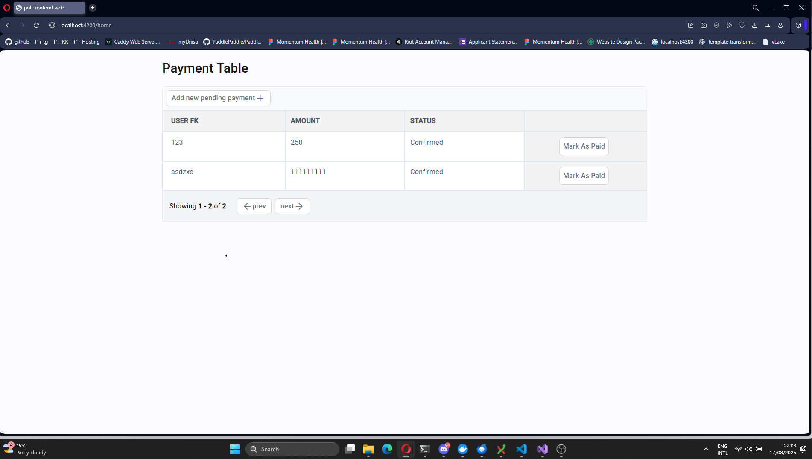

# PaymentOrchestrator Lite — Frontend

A lightweight Angular frontend for the PaymentOrchestrator Lite project.


## Prerequisites

- .NET 8 SDK installed or
- Docker 

## Quick Start (Local)
1. Start the development server:
```bash
dotnet run --project Api
```
2. Open your browser to swagger at http://localhost:7013/swagger/index.html

## Quick Start (Docker)

1. Cd into API:

```bash
cd Api
```

2. Build and run using Docker:

```bash
docker compose up
```
2. Open your browser to swagger at http://localhost:7013/swagger/index.html


